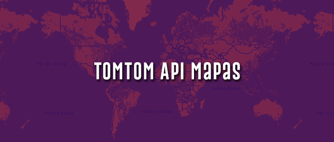

<div align="center">
  <p align="center">
    
  </p>
 <h1>Tomtom Api Maps</h1>
 <h3>Alternativa para subistituir Google Maps<h3>
</div>

1. Crie o projeto React Typescript
```bash
$ npx create-react-app tomtom-map-api --template=typescript
```

2. Crie a chave api em: https://developer.tomtom.com/

3. Instale o pacote Tomtom Maps
```bash
$ npm i @tomtom-international/web-sdk-maps
```
4. Instale Tomtom Services
```
$ npm i @tomtom-international/web-sdk-services
```

5. Instale React-toastify
```
$ npm i react-toastify
```

6. Instale react-router-dom
```
$ npm i react-router-dom
```
